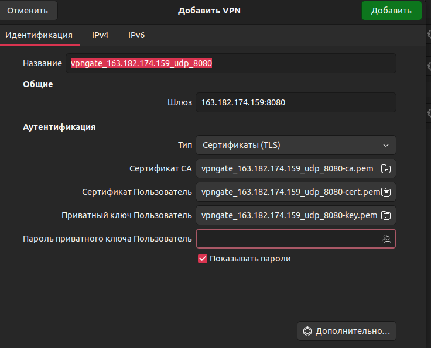

# Приложение для технического анализа криптовалют

<div style="text-align: center;">



</div>

Проект представляет собой графическое веб-приложение по работе с биржевыми котировками c сайта `binance.com`, которое тебя научит делать деньги на финасовых операциях. Пользователю предоставляется уникальная возможность отслеживать свечи на интерактивном графике и до 5 (ограничение лишь для лучшей визуализации) технических индикаторов одновременно. 

Всего приложение позволяет отобразить 15 индикаторов: 

* Chande Forecast Oscillator: `cfo`
* Moving Average Convergence Divergence: `macd`
* Percentage Price Oscillator: `ppo`
* Relative Strength Index: `rsi`
* Stochastic Oscillator: `stoch`
* Exponential Moving Average: `ema`
* Kaufman's Adaptive Moving Average: `kama`
* Simple Moving Average: `sma`
* Weighted Moving Average: `wma`
* Average True Range: `atr`
* Bollinger Bands: `bbands`
* Accumulation/Distribution Index: `ad`
* Chaikin Money Flow: `cmf`
* Rate of Change: `roc`
* KST Oscillator: `kst`,

основные 5 из которых написаны без использования библиотеки `pandas_ta` и включают `pytest` тесты.

## Инструкция по

* установке библиотек:
```sh
pip install -r requirements.txt
```
* запуску веб-приложения:
```sh
streamlit run main.py
```
* прогону тестов:
```sh
py.test -v tests/indicator_tests.py
```
